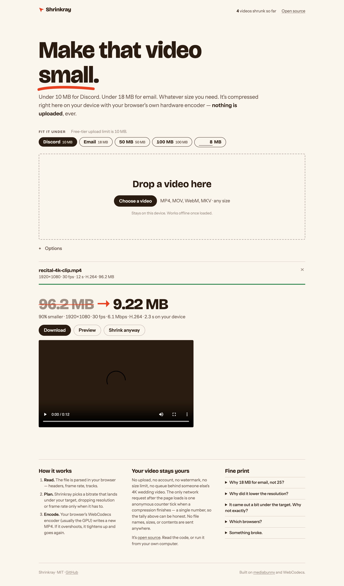

# Shrinkray

Compresses a video to a target file size in the browser. The file is not uploaded anywhere.

https://asharahmed.github.io/shrinkray/



Choose a size limit (10 MB for Discord, 18 MB for email, or a number you type), add a video, and download the
result as an MP4. Encoding uses WebCodecs, so it runs on the GPU in most browsers. A 160 MB, 20-second 1080p clip
takes about 5 seconds on an M1 MacBook.

## How it works

1. The file is parsed in the browser with [mediabunny](https://mediabunny.dev): container, tracks, frame rate, duration.
2. `plan.js` converts the size limit into a bitrate. Audio gets a share of the budget based on how much is
   available. If the video bitrate would be too low for the source resolution, the output is scaled to the next
   standard height. 60 fps sources are reduced to 30 fps only when the budget requires it.
3. mediabunny decodes and re-encodes the video (H.264 by default; HEVC and AV1 are options) and writes a
   fast-start MP4 with AAC audio. The first pass aims 7% under the limit. If the output is still too large, the
   bitrate is reduced and the file is encoded again, up to three passes. If the hardware encoder fails, the
   software encoder is used.

There is no build step. `plan.js` is the planning code and has unit tests. `shrink.js` is the encoding code.
`app.js` is the page.

## Privacy

The page is static. There is no server that receives files.

When a compression finishes, the page sends one request to a public hit counter (abacus.jasoncameron.dev) to
increment a number. The request contains no information about the file or the user. The "videos compressed"
count on the page reads from the same counter. The request is not sent when the page is served from localhost.

Fonts are loaded from Google Fonts. The page registers a service worker and works offline after the first load.

## Browser support

Chrome, Edge, Brave, Arc, Opera, Safari 17 or later, and Firefox 130 or later. WebCodecs with an H.264 encoder
is required; the page shows a notice if the browser does not have it. If the browser cannot encode AAC, audio
is encoded as Opus instead.

## Running locally

```sh
git clone https://github.com/asharahmed/shrinkray
cd shrinkray
python3 -m http.server 8123   # any static file server works
open http://127.0.0.1:8123/
```

## Tests

```sh
npm test               # planning math
npm run fixtures       # generates test videos with ffmpeg into test/fixtures
npm run test:browser   # runs the fixtures through headless Chrome and checks the output with ffprobe
```

`test:browser` needs Google Chrome (or `CHROME=/path/to/chrome`) and ffprobe on the PATH.

## Reporting problems

If a file does not convert, [open an issue](https://github.com/asharahmed/shrinkray/issues) with the browser
version and what produced the file (phone model, screen recorder, etc.).

## License

MIT. The vendored `vendor/mediabunny.min.mjs` is [mediabunny](https://github.com/vanilagy/mediabunny), MPL-2.0.
